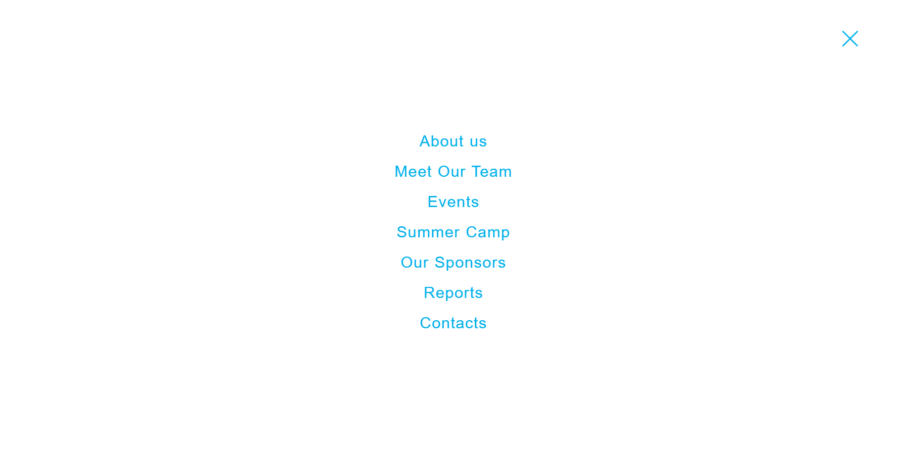

# Volunteering NGO Website 🚧 (Work in Progress)

This is a website project for a volunteering NGO aimed at connecting volunteers with community initiatives.  
Built with HTML, CSS, and JavaScript.

## 🌟 Project Goal

To create an easy-to-navigate, informative platform that showcases past projects, volunteer opportunities and helps users get involved with local projects.

## 🌐 Live Demo

Check out the current version here: [https://bianca574.github.io/volunteering_website/]

## 🛠️ Tech Stack

- HTML
- CSS
- JavaScript

## 🚀 Current Status

- Basic layout and navigation setup ✔️
- Day/Night mode switch button ✔️
- Content sections under development 🔄  
- Interactive features (forms, user feedback) pending ⏳

## ✅ TODO

- Finalize content 
- Add volunteer sign-up form  
- Implement responsive design improvements  
- Optimize for accessibility  
- Deploy on GitHub Pages

## 📸 Screenshot

## 📄 License

This project is closed-source. All rights reserved.
